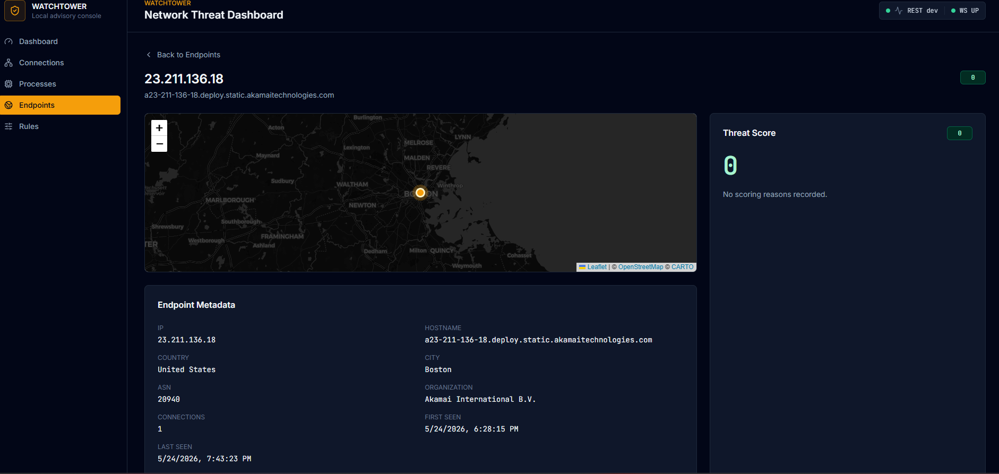
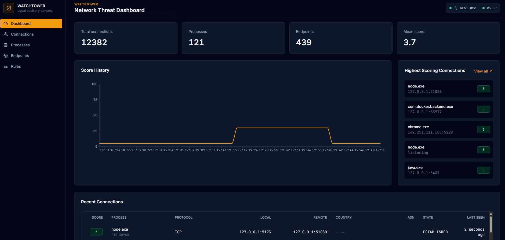
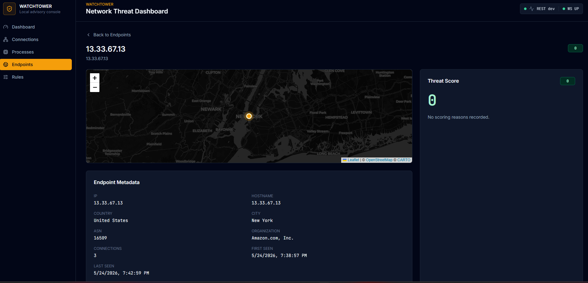
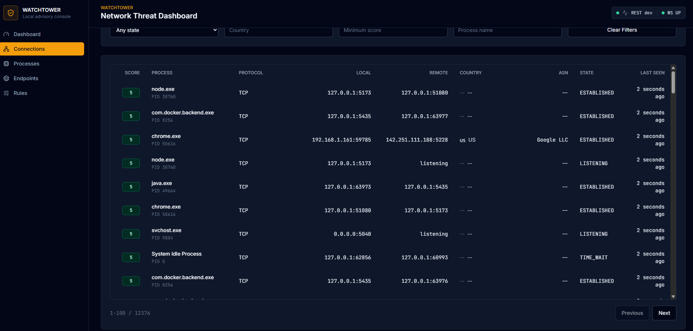
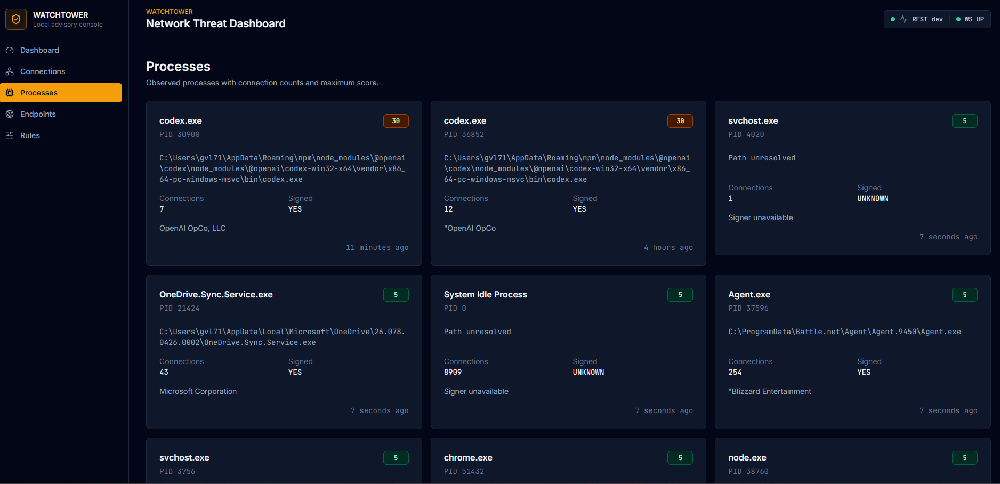

# Watchtower

A local network threat dashboard for Windows. Watchtower watches every connection your machine makes, figures out who's on the other end, scores it against a rules engine, and shows you everything in a real-time dashboard.

It does not block, kill, or modify anything. By design, it cannot. It only observes and reports.



---

## Why I built this

I'm a Labor Services Representative at the NYS Department of Labor with 15+ years of state service and an MS in Computer Science. I'm transitioning into tech — data analytics, software engineering, IT — and I needed a portfolio piece that proves I can do the work, not just talk about it.

Watchtower is that piece. I picked it because:

- It uses a real full stack (Java, Spring, Postgres, React, TypeScript, Docker, WebSockets) — the same stack a lot of jobs I'm applying to actually run on.
- It solves a problem I genuinely have. I wanted to know what my computer is doing on the network at any given moment. Now I do.
- It has architectural constraints that matter. The "advisory only, never acts" rule isn't just a feature — it's the kind of decision a real engineer has to defend in code review.
- It's something I'll actually keep using.

I built v1 over about a day, then added the detail-view layer (v1.1) the same evening. The whole thing runs on my machine right now while I'm typing this.

---

## What it does

Every few seconds, Watchtower polls `netstat` to see what your computer is connected to, looks up who owns each remote IP (GeoIP, ASN, reverse DNS), checks each connection against a rules engine, and writes everything to Postgres. The dashboard updates in real time over a WebSocket.



The four cards at the top track totals. The chart shows scoring trends over time. The right rail surfaces whatever is scoring highest right now. The table at the bottom is the live feed of every connection observed, updated in place over WebSocket.

The seven scoring rules cover things like:
- Binaries running from `AppData\Temp` making outbound connections
- Unsigned executables phoning home
- Connections to high-risk countries
- AbuseIPDB-flagged IPs
- Beacon-like cadences (same process + endpoint hitting at regular intervals)
- Uncommon ports
- Browsers reaching into private IP ranges

Each rule contributes points, the total is capped at 100, and every score includes the reasons it fired. Nothing gets blocked. Nothing gets killed. You just see the data and decide what it means.

### Drilling in

The interesting part is what happens when you click something. Every IP, every process, every connection has its own detail page with a map, a metadata card, a threat score breakdown, a time-series chart of observations, and the full list of related entities.



You can walk the graph: click a process to see every endpoint it talks to, click an endpoint to see every process that talks to it, click any IP anywhere to land on its geolocated detail page. The whole UI turns into an investigation tool.

### Browsing connections and processes

The Connections page is a filterable, paginated table of everything Watchtower has seen. Every row is clickable.



The Processes page groups everything by executable, showing the path, signature status, signer, and the score the rules engine assigned. Useful for spotting binaries running from places they shouldn't be.



That `codex.exe` card scoring 30 in the screenshot is a good example of the rules engine behaving correctly: the binary is signed by OpenAI (legitimate), but it runs from `AppData\Roaming\npm` (which triggers the `TEMP_PATH_EXEC` rule) and makes outbound connections (which the rule combines into a moderate score). Worth noticing, not worth panicking. That's the whole design philosophy in action.

---

## The architecture, in one paragraph

A Spring Boot 3.4 backend (Java 21) runs scheduled tasks that poll `netstat` and `tasklist`, enrich the results with GeoIP (MaxMind GeoLite2), reverse DNS, and optional AbuseIPDB threat intel, then run them through a pluggable rules engine and persist everything to Postgres 16. A React 18 + TypeScript + Vite frontend with Tailwind and shadcn/ui consumes a read-only REST API and a STOMP-over-WebSocket stream for live updates. Postgres runs in Docker. Everything binds to `127.0.0.1` only.

```
netstat → ProcessBuilder → snapshots
  → enrichment (GeoIP, reverse DNS, AbuseIPDB)
  → rules engine (7 pure-function rules)
  → Postgres (6 tables, Flyway migrations)
  → REST + WebSocket
  → React dashboard
```

There is no agent. No driver. No kernel hook. No outbound traffic at startup. No code path that can modify the host. The advisory-only constraint is enforced architecturally, not by policy.

---

## Tech stack

**Backend:** Java 21, Spring Boot 3.4.5, Spring Data JPA, Spring WebSocket (STOMP), Flyway, PostgreSQL 16, Hypersistence Utils (INET/JSONB), Caffeine, MaxMind GeoIP2

**Frontend:** React 18, TypeScript (strict), Vite, Tailwind, shadcn/ui, TanStack Query v5, React Router v6, Recharts, Leaflet + react-leaflet, @stomp/stompjs

**Infrastructure:** Docker Compose (Postgres 16), Maven, npm

---

## Running it locally

You need: Docker Desktop, Java 21, Maven, Node 20+.

```bash
# 1. Postgres
docker compose up -d

# 2. Backend (port 8088)
cd backend
mvn spring-boot:run

# 3. Frontend (port 5173) — in a separate terminal
cd frontend
npm install
npm run dev
```

Open `http://127.0.0.1:5173`.

### Optional enrichment

Without these, Watchtower still works — it just shows less data. Both warn-and-continue at startup.

**GeoIP:** download `GeoLite2-City.mmdb` and `GeoLite2-ASN.mmdb` from MaxMind (free account) and drop them in `~/.watchtower/geoip/`.

**AbuseIPDB:** set `ABUSEIPDB_API_KEY` as an environment variable before starting the backend. Free tier is 1000 lookups/day.

---

## What's where

```
watchtower/
├── backend/                Spring Boot app
│   └── src/main/java/com/gluna/watchtower/
│       ├── capture/        netstat polling + parsing
│       ├── process/        tasklist + signature checks
│       ├── enrichment/     GeoIP, reverse DNS, AbuseIPDB
│       ├── scoring/        rules engine + 7 rules
│       ├── model/          JPA entities
│       ├── repo/           Spring Data repositories
│       ├── service/        ingest, orchestration
│       ├── api/            REST controllers + DTOs
│       └── ws/             STOMP WebSocket
├── frontend/               React + TS + Vite
├── docker-compose.yml      Postgres only
└── PROJECT-SPEC.md         the spec I built it from
```

---

## What's next

The architecture is set up to make these straightforward additions, not rewrites:

- **ML anomaly layer.** Isolation Forest trained on a few weeks of collected connection data, deployed as a FastAPI sidecar. The rules engine already emits scores as one input among many, so adding an `ML_ANOMALY` reason is a clean extension. This is the next thing I'm building.
- **Process whitelist.** A `whitelisted_processes` table so known-good apps stop contributing to the noise floor.
- **Behavioral baselines per process.** "Chrome connecting to a never-before-seen ASN at 4 AM" is a much stronger signal than the rules engine catches today.
- **Linux + macOS support.** Replace `netstat -ano` with `ss -tunap` / `lsof -i`. The capture layer abstracts cleanly enough that this is mostly a parser per OS.

---

## A note on what this is and isn't

This is a personal project I built to learn the stack and to see what's happening on my own machine. It is not a commercial-grade security product. It will not catch a sophisticated attacker. It can be wrong, sometimes very wrong, because anomaly detection on a one-person dataset is hard.

What it *is* is a working full-stack application that handles real concurrency, real OS integration, real external APIs, and presents the results in a UI that doesn't look like a tutorial.

I'm proud of it. If you're a hiring manager or recruiter and you want to talk about it, I'd love to hear from you.

**Greg Luna**
[LinkedIn](https://linkedin.com/in/gregvluna) · [GitHub](https://github.com/gregluna4809)
